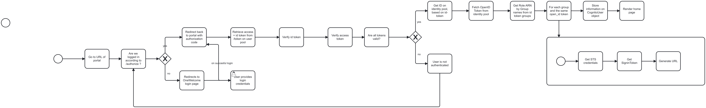

# The login process

See the BPMN chart below that explains the different token exchanges that take
place throughout the login process. This chart was created to have a better
overview of which steps take place.

## Definitions

- _JWT_ - JSON Web Token as defined
  by [RFC 7519](https://datatracker.ietf.org/doc/html/rfc7519).
- _Access Token_ - JWT that provides access to a resource server, or allows
  obtaining additional information from the authorization server. Access Tokens
  are defined in
  the [OAuth2 standard](https://datatracker.ietf.org/doc/html/rfc6749#section-1.4).
- _ID-token_ - JWT that describes the identity of a user, as defined in
  the [OpenID Connect Core (OIDC) standard](https://openid.net/specs/openid-connect-core-1_0.html#IDToken).
- _Open ID token_ - JWT generated by an AWS Cognito Identity Pool. It contains
  IAM information, and some user information that can be used to obtain
  temporary credentials from AWS STS. It can
  be [obtained using an ID-token](https://docs.aws.amazon.com/cognitoidentity/latest/APIReference/API_GetOpenIdToken.html),
  but is in no other way related to the OIDC standard.
- _STS credentials_ - Short-lived Token Service (STS) credentials that allow
  temporary access to AWS API's and Console, using a specific IAM Role. They
  are similar to the ones used to configure the AWS CLI.
- _Signin Token_ - Token that can be used to signin as a particular IAM role to
  the AWS Console. The process to obtain such a token using STS credentials
  is described [here](https://docs.aws.amazon.com/IAM/latest/UserGuide/id_roles_providers_enable-console-custom-url.html).